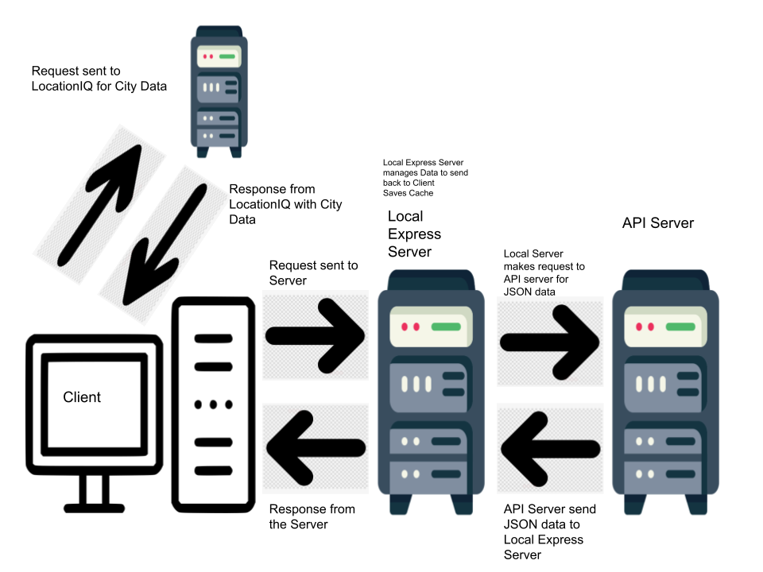

# City Explorer

[Live site](https://cityexploreryeet.netlify.app/ )
[Front end GH](https://github.com/cfosprof/city-explorer)
[Backend API GH](https://github.com/cfosprof/city-explorer-api)

**Author**: Christopher Foster 
**Version**: 1.0.0

## Overview

City Explorer is a web application that allows users to explore cities by searching for city names. Users can view the exact latitude and longitude of the location, as well as a map of the area, movies with the cities title, and weather for the city. The application now features an in-memory cache to optimize API requests for weather and movie data.

## Getting Started

To build this yourself, follow these steps:

1.  Clone the repository from GitHub to your local machine.
2.  Navigate to the directory in your terminal.
3.  Run `npm install` to install necessary dependencies.
4.  Create a `.env` file in the root of your project directory and add your API keys for LocationIQ.
5.  Run `npm start`

## Architecture

This application is built using React for the frontend and, optionally, Node.js with Express.js for the backend (if you decide to create a separate server). It uses the following libraries and technologies:

-   [React](https://reactjs.org/) - The web framework used
-   [axios](https://github.com/axios/axios) - Promise-based HTTP client for the browser and Node.js
-   [LocationIQ](https://locationiq.com/) - Geocoding and maps API
-   [Bootstrap](https://getbootstrap.com/) - CSS framework for styling
-   (Optional) Weather and Movie APIs for fetching weather and movie data
-   (Optional) Node.js and Express.js for server-side implementation
- (Optional) Google Maps API
- -   In-memory cache for server-side data storage

## Change Log

03-20-2023 1:00 pm - Set up the initial React app and added components for LocationForm and LocationInfo.

03-20-2023 2:30 pm - Implemented floating labels using React-Bootstrap and added a static map image using the LocationIQ API.

03-20-2023 7:00 pm - Updated error handling to display clear messages for the user.

03-21-2023 - Set up city-explorer-api repository and server, implemented API endpoint for weather, and created Weather component to render forecast data. Added error handling for API calls.

03-22-2023 - Integrated weather API and movie API, created Movies component to display movie information, and deployed API server to production cloud environment.

03-23-2023 - Refactored server.js by moving weather and movie functionality into separate files, further componentized UI elements, and deployed changes to production.

03-24-2023 - Integrated provided starter code and implemented in-memory cache for optimizing weather and movie API requests. Fixed bugs in the starter code and ensured smooth functioning of the weather module.

## Credit and Collaborations

-   [Logan Reece](https://github.com/LogiDaBear)
-   [Emmanuel Gonzalez](https://github.com/Emmanuel-Gonzales)
-   [React DOCS](https://react.dev/)
-   [React-Bootstrap](https://react-bootstrap.github.io/)
-   [LocationIQ](https://locationiq.com/docs)

## Features

1.  Set up your React repository & API keys.
    
    -   Estimate of time needed to complete: 30
    -   Actual Time: 30
2.  Locations: As a user of City Explorer, I want to enter the name of a location so that I can see the exact latitude and longitude of that location.
    
    -   Estimate of time needed to complete: 2 hours
    -   Actual: About 2 hours
3.  Map: As a user, I want to see a map of the city so that I can see the layout of the area I want to explore.
    
    -   Estimate of time needed to complete: 1 hour
    -   Actual: 45 minutes
4.  Weather: As a user, I want to see the weather forecast for the city so that I can plan my activities.
    
    -   Estimate of time needed to complete: 3 hours
    -   Actual: 3 hours
5.  Movies: As a user, I want to see a list of movies related to the city so that I can learn more about the location's culture and history. - Estimate of time needed to complete: 3 hours - Actual: 3 hours

6.  Deploy: As a user, I want to access the City Explorer app on a publicly available URL so that I can share it with others.
    
    -   Estimate of time needed to complete: 1 hour
    -   Actual: 1 hour
7.  Refactor: As a developer, I want to organize my code for better maintainability and readability.
    
    -   Estimate of time needed to complete: 2 hours
    -   Actual: 2 hours
8.  Componentize: As a developer, I want to create reusable components to improve the structure and organization of my application.
    
    -   Estimate of time needed to complete: 2 hours
    -   Actual: 2 hours

